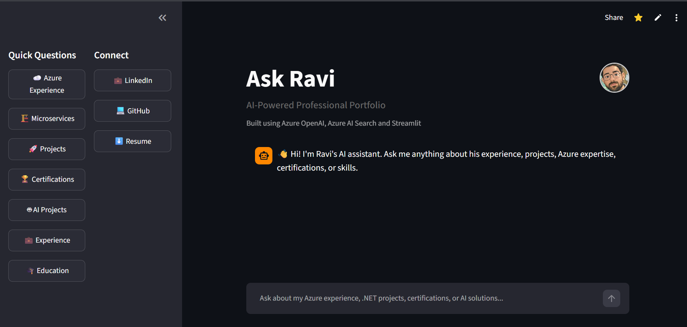
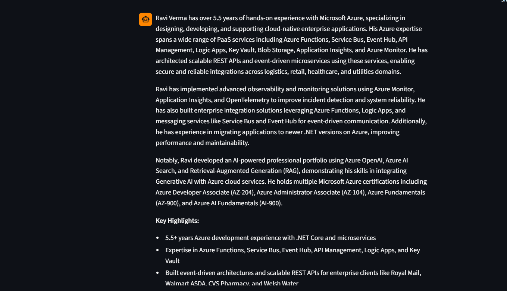
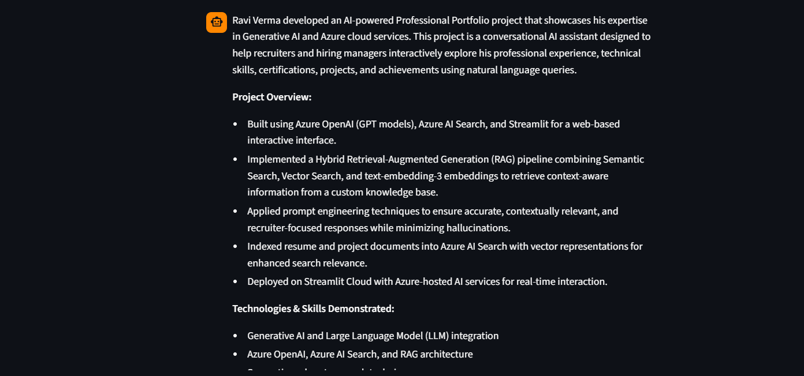
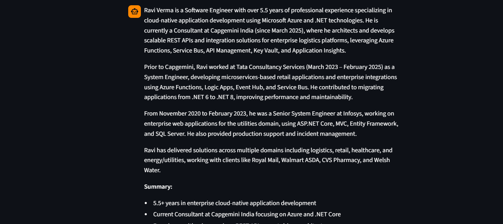

# 🤖 AI-Powered Career Portfolio using Azure OpenAI

An AI-powered conversational portfolio built using **Azure OpenAI**, **Azure AI Search**, and **Retrieval-Augmented Generation (RAG)** that enables recruiters and hiring managers to interactively explore my professional experience, technical expertise, certifications, enterprise projects, and achievements through natural language conversations.

Instead of browsing a traditional resume, users can ask questions such as:

- Why should I hire Ravi?
- What Azure services has Ravi worked with?
- Tell me about Ravi's experience at Royal Mail.
- Explain Ravi's AI project.
- What Microsoft certifications does Ravi hold?

The application retrieves relevant information from an indexed knowledge base using **Hybrid Search (Keyword + Vector + Semantic Search)** and generates accurate, context-aware responses using **Azure OpenAI GPT**.

---

# 🚀 Live Demo

**Application:** https://ask-ravi.streamlit.app/

---

# ✨ Features

- AI-powered conversational portfolio
- Natural language question answering
- Retrieval-Augmented Generation (RAG)
- Hybrid Search for improved retrieval accuracy
- Semantic Search
- Vector Search
- Azure OpenAI GPT integration
- Azure OpenAI Embeddings
- Prompt Engineering
- Recruiter-focused responses
- Resume download
- LinkedIn & GitHub integration
- Conversation history
- Responsive Streamlit interface

---

# 🏗 Architecture

```
                                User
                  │
                  ▼
        Streamlit Web Application
                  │
                  ▼
      Azure OpenAI (Embeddings)
                  │
                  ▼
           Azure AI Search
     Hybrid + Vector + Semantic
                  │
                  ▼
      Indexed Knowledge Base
        (Azure Blob Storage)
                  │
                  ▼
     Retrieved Relevant Chunks
                  │
                  ▼
      Azure OpenAI GPT Model
                  │
                  ▼
         Context-aware Answer
```

---

# ⚙ Technology Stack

## AI

- Azure OpenAI (GPT)
- Prompt Engineering
- Retrieval-Augmented Generation (RAG)

## Search

- Azure AI Search
- Hybrid Search
- Semantic Search
- Vector Search
- text-embedding-3-small

## Azure

- Azure OpenAI
- Azure AI Search
- Azure Blob Storage
- Azure AI Foundry

## Backend

- Python

## Frontend

- Streamlit

## Version Control

- Git
- GitHub

---

# 🔍 How It Works

### 1. Knowledge Base

Professional information including:

- Resume
- Work Experience
- Projects
- Skills
- Certifications
- Education

is stored in Azure Blob Storage.

---

### 2. Indexing

Documents are indexed into Azure AI Search.

During indexing:

- Documents are chunked
- Vector embeddings are generated using **text-embedding-3-small**
- Chunks are stored with embeddings for semantic retrieval

---

### 3. User Question

When a recruiter asks a question:

Example:

> "Why should I hire Ravi?"

---

### 4. Retrieval

The application performs Hybrid Search by combining:

- Keyword Search
- Vector Search
- Semantic Ranking

to retrieve the most relevant document chunks.

---

### 5. Response Generation

Retrieved context is passed to Azure OpenAI GPT along with a recruiter-focused system prompt.

The model generates a grounded response without hallucinating information outside the indexed documents.

---

## 🧠 Retrieval-Augmented Generation (RAG) Pipeline

This project uses a Retrieval-Augmented Generation (RAG) architecture to generate accurate, grounded responses based on my professional documents.

### Workflow

1. User submits a question through the Streamlit application.
2. Azure OpenAI generates an embedding for the user's query.
3. Azure AI Search performs **Hybrid Search**, combining:
   - Keyword Search
   - Vector Search
   - Semantic Ranking
4. The most relevant document chunks are retrieved from the indexed knowledge base.
5. Retrieved context is injected into the system prompt.
6. Azure OpenAI GPT generates a context-aware response using only the retrieved information.
7. The response is displayed to the user.

### Benefits

- Reduces hallucinations
- Ensures responses are grounded in indexed documents
- Provides accurate, recruiter-focused answers
- Supports natural language interaction over professional knowledge

---

# 📁 Project Structure

```
ask-ravi-bot/
│
├── app.py
├── prompts/
├── services/
│   ├── openai_service.py
│   └── search_service.py
├── utils/
├── resume/
├── requirements.txt
└── README.md
```

---

# ▶ Running Locally

```bash
git clone https://github.com/raviverma9807/ask-ravi-bot.git

cd ask-ravi-bot

pip install -r requirements.txt

streamlit run app.py
```

Configure the following environment variables before running:

- Azure OpenAI Endpoint
- Azure OpenAI Key
- GPT Deployment
- Embedding Deployment
- Azure AI Search Endpoint
- Azure AI Search Key
- Azure AI Search Index

---
## 📸 Screenshots

### Home



### Azure Experience



### AI Project



### Work Experience



### Certifications


---

# 🎯 Future Enhancements

- Conversation memory
- Streaming AI responses
- Voice interaction
- Multi-user portfolio support
- Resume upload and dynamic indexing
- Recruiter analytics dashboard

---

# 👨‍💻 About

Developed by **Ravi Verma**

Azure .NET Developer | Azure OpenAI | Azure AI Search | Generative AI | Microservices | Cloud-native Applications

LinkedIn:
https://www.linkedin.com/in/ravi-verma-2b757817b/

GitHub:
https://github.com/raviverma9807/
